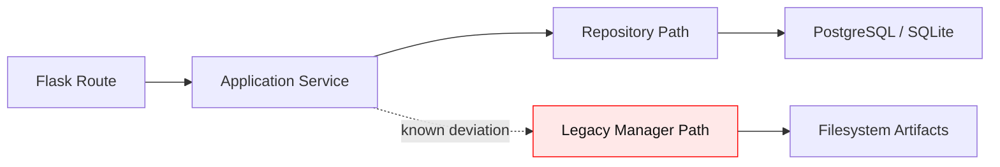

# Architecture Notes

Updated: 2026-05-11

## Real Code Layout

The backend codebase is organized under `backend/app`, not `backend/src`.

Key areas:

- `backend/app/auth`: users, password auth, JWT, API keys, permissions, tenant guard.
- `backend/app/api`: graph, simulation, report, and consumer API routes.
- `backend/app/middleware`: rate limiting and request middleware.
- `backend/app/repositories`: filesystem and SQLAlchemy repository adapters.
- `backend/app/security`: audit logging and redaction utilities.
- `backend/app/redis`: readiness helpers.

## Auth Flow

1. Register validates password strength and stores a bcrypt hash.
2. Login resolves username/email/user_id and verifies password.
3. Successful login signs HS256 JWT with `sub` and `jti`.
4. Protected endpoints load user context from Bearer JWT or `X-API-Key`.
5. Permission decorators and `TenantGuard` enforce route access.

## Tenant Model

`Project` now carries optional `tenant_id` metadata. New projects inherit the authenticated user's tenant. Legacy projects without `tenant_id` remain compatible where existing tests require it, but tenant checks prefer explicit ownership.

## Frontend Routing

`/process/:projectId` routes to `MainView.vue`. `Process.vue` is treated as stale legacy UI and no longer contains the environment setup alert. The active Step1 component creates a simulation and routes to `Simulation` on success; failures render component state.

## Known Residual Work

The current architecture intentionally keeps the Flask application factory,
application services, repositories, and consumer-society runtime in one
deployable unit while the product fit and simulation contracts stabilize.

## 技术栈演进路线图

MiroConsumer has moved through seven implementation phases. The timeline below
is the canonical reader-facing map for why the stack looks the way it does.

| Phase | Technical decision | Reason |
| --- | --- | --- |
| Phase 1 | Flask API plus Vue 3 workbench | Keep the first consumer-test loop easy to run locally and easy to inspect. |
| Phase 2 | BusinessBrief contract and consumer persona pack | Make concept, copy, audience, scene, and research goal explicit before simulation. |
| Phase 3 | OASIS-compatible multi-agent runtime | Reuse a proven social simulation model instead of hand-rolling propagation primitives. |
| Phase 4 | Evidence validation, confidence scoring, and benchmark replay | Make every report finding traceable, replayable, and comparable to stable baselines. |
| Phase 5 | LiteLLM-style LLM gateway and prompt guard boundary | Centralize model routing, timeout handling, and prompt-injection protection. |
| Phase 6 | Pydantic v2 request contracts and typed frontend modules | Reduce API drift between Flask routes, tests, and the Vue TypeScript surface. |
| Phase 7 | uv, Python 3.12 runtime, non-root Docker, metrics, and tenant guard | Move the stack from research prototype toward production operations. |

Key technology choices:

- **OASIS**: selected for agent interaction semantics and social-propagation fit.
- **LiteLLM proxy layer**: selected so model providers can be swapped while policy,
  timeout, and fallback behavior stay centralized.
- **Pydantic v2**: selected for explicit API schemas, field descriptions, and
  strict validation of evolving BusinessBrief contracts.
- **uv**: selected to keep Python dependency resolution reproducible across CI,
  Docker, and local development.
- **Vue 3 + TypeScript**: selected for a progressively typed research workbench
  without forcing a full product rewrite.

未来6个月 roadmap:

- Finish durable PostgreSQL persistence for graph snapshots, branch replay
  artifacts, and persona-pack audit history.
- Add platform adapters for Xiaohongshu, Weibo, Douyin, and Zhihu channel
  calibration so platform-specific propagation assumptions are explicit.
- Improve Redis cache policy for report, graph, and benchmark replay hot paths.
- Split worker queues by simulation, report, and export workloads when traffic
  requires independent scaling.
- Promote benchmark and confidence calibration data into a reviewed artifact
  registry.

README readers can use this section as the compact history of the technical
stack; detailed deployment and operations choices remain in `DEPLOYMENT.md` and
`docs/deployment.md`.

## Architecture Decision Records

### ADR-001: Service Locator Over Constructor Injection

Status: accepted as transitional architecture.

The runtime container still resolves repositories and managers through a Service
Locator style boundary. Constructor injection remains the target for new
application services, but current route modules and report flows share managers
that need a staged migration. The accepted tradeoff is to keep Service Locator
resolution at the edge while new domain services receive explicit dependencies.

Known deviation marker: Service Locator remains in the
runtime path until the container split is complete.

### ADR-002: Classmethod Application Services As Technical Debt

Status: accepted with migration plan.

`ConsumerAppService` and several sibling application services expose
`@classmethod` operations. This preserves legacy call sites, but it hides
stateful dependencies and makes isolated tests harder. New code should prefer
instance services with explicit repositories. Existing classmethod facades will
be converted behind compatibility wrappers after route contracts stop importing
the concrete classes directly.

Known deviation marker: @classmethod facades are a
documented technical debt, not the target pattern.

### ADR-003: create_app() Split Plan

Status: in progress.

`create_app()` previously handled configuration validation, observability,
CORS, auth, rate limiting, blueprint registration, health routes, and OpenAPI
generation in one place. The implementation now delegates those responsibilities
to helpers such as `create_flask_app`, `init_observability`, `init_extensions`,
`register_request_hooks`, and `register_blueprints`. The next step is to move
OpenAPI construction and security headers into dedicated modules so the factory
remains orchestration only.

Known deviation marker: the app factory still owns route
registration and OpenAPI wiring during the transition.

### ADR-004: Repository+Manager Dual Persistence Path

Status: accepted as migration bridge.

The codebase currently contains both SQLAlchemy repositories and legacy manager
classes. This Repository+Manager path is intentional while persistence is being
cut over: repositories own durable storage contracts, while managers preserve
backward-compatible filesystem behavior for older simulations and reports. New
features must write through repositories when durable state is required and may
read legacy manager data only as a compatibility fallback.

Migration plan:

1. Keep route handlers talking to application services rather than managers.
2. Move newly persisted artifacts into repository tables first.
3. Add read-through adapters for legacy filesystem artifacts.
4. Remove direct manager imports after parity tests cover the repository path.

